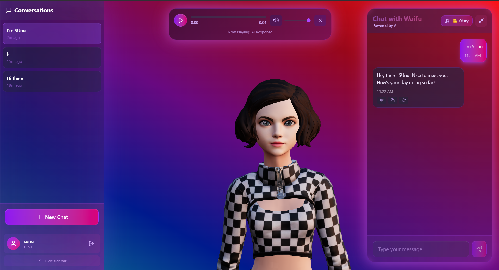

UNIVERSITY INSTITUTE   
OF ENGINEERING AND TECHNOLOGY  
KURUKSHETRA UNIVERSITY, KURUKSHETRA

Lab Project: **3D AI talking robot**

**Interactive AI-Powered 3D Animated Chat Assistant**

Submitted to: 						        Submitted by:

Dr. Sanjeev Dhawan				        Dhananjay

Professor, UIET KUK					Roll no. 252202045

									CSE-A, Semester-7

**ABSTRACT**

This project presents *3D AI talking robot*, an interactive AI-powered chat application featuring a fully animated 3D character that engages users in natural conversations. Built with modern web technologies, the system combines React Three Fiber for 3D rendering, Google Gemini AI or local AI models (Ollama) for intelligent conversations, and Speechify text-to-speech for voice synthesis. The application features emotion-based animations that respond dynamically to conversation context, creating an immersive user experience. The frontend leverages React.js with TypeScript for type-safe development, while the backend uses Node.js with Express.js to handle API requests, authentication, and AI service integration. MongoDB stores user data and conversation history, while Redis provides efficient response caching. The system supports multiple personality types (Friendly, Tsundere, Kuudere, Dandere, Yandere) and allows users to customize their interaction experience. The 3D character model, powered by Ready Player Me, responds with appropriate animations (Idle, Talking, Shy, Angry, Greeting) based on detected emotions in the AI responses. This project showcases a production-ready, scalable architecture ideal for interactive AI applications and demonstrates the integration of 3D graphics, artificial intelligence, and modern web development practices.

**PROJECT PREVIEW**

**Technologies/Tools Used**

### **1. React.js & TypeScript**

React.js is a widely-used JavaScript library developed by Facebook for building interactive user interfaces. In this project, React.js powers the frontend, delivering a responsive and dynamic experience. TypeScript provides type safety, reducing runtime errors and improving code maintainability. The component-based architecture allows developers to create reusable UI elements like the 3D avatar, chat interface, and conversation sidebar. React's virtual DOM ensures efficient updates and rendering, making the application fast and user-friendly. Additionally, React hooks facilitate seamless state management and lifecycle handling across the app. The modular design makes it scalable and maintainable, which is crucial for a complex application like an interactive AI chat assistant.

### **2. React Three Fiber & Three.js**

React Three Fiber is a React renderer for Three.js, enabling declarative 3D graphics in React applications. In this project, React Three Fiber powers the 3D animated character, providing high-performance rendering of the waifu avatar. Three.js serves as the underlying 3D graphics library, handling WebGL rendering, scene management, and animation systems. The system loads 3D models in GLB format from Ready Player Me and animates them using FBX animation files. The integration allows for smooth animation transitions between different emotional states (Idle, Talking, Shy, Angry, Greeting), creating a lifelike interactive experience. OrbitControls enable users to manipulate the camera view, enhancing user engagement with the 3D character.

### **3. Node.js & Express.js**

Node.js is a JavaScript runtime built on Chrome's V8 engine, enabling server-side execution of JavaScript. In this project, Node.js serves as the backbone of the backend infrastructure. Express.js provides a robust web application framework for building RESTful APIs. It handles API requests, manages authentication via JWT tokens, interfaces with AI services, and coordinates database operations. Its asynchronous, event-driven nature allows the server to handle concurrent operations efficiently, which is vital when multiple users are interacting with the application simultaneously. Node's vast package ecosystem (npm) also supports integration with key tools like MongoDB, Redis, and various AI service SDKs.

### **4. Google Gemini AI & Ollama**

The project supports dual AI providers for flexibility and privacy. Google Gemini AI provides cloud-based advanced language model capabilities through the Generative AI SDK, offering high-quality conversational responses with emotion detection. Ollama enables local AI model hosting, allowing users to run AI models entirely on their own infrastructure for complete data privacy. The system includes a unified AI service that seamlessly switches between providers based on configuration, ensuring that the application works regardless of the chosen AI backend. This dual-provider approach demonstrates modern AI integration patterns and provides users with choice between cloud convenience and local privacy.

### **5. Speechify Text-to-Speech**

Speechify is a high-quality text-to-speech service that converts AI-generated responses into natural-sounding audio. The integration supports both client-side and server-side audio generation, providing flexibility in implementation. Multiple voice profiles are available, allowing users to customize their experience. The system includes audio caching to improve performance and reduce API calls. A custom audio player component provides playback controls, enabling users to listen to AI responses with full control over playback, volume, and progress. This feature enhances the immersive experience by adding voice to the animated character.

### **6. MongoDB & Mongoose**

MongoDB is a NoSQL database designed for scalability and flexibility, while Mongoose is an ODM (Object Data Modeling) library for Node.js that simplifies interactions with MongoDB. In this project, MongoDB stores user accounts, conversation history, messages, and application metadata in a schema-less format that aligns well with the dynamic nature of chat data. Mongoose provides a structured way to define models (User, Conversation, Message) and query the database, improving data integrity and code maintainability. The database design supports features like conversation pagination, pinning, archiving, and per-conversation settings, enabling a rich user experience.

### **7. Redis**

Redis is an in-memory key-value store known for its speed and versatility. In this project, Redis is used for response caching, storing frequently asked questions and their AI responses to reduce API calls and improve response times. The caching layer helps optimize costs when using cloud AI services and improves user experience by providing instant responses for common queries. Redis's low latency and high throughput make it ideal for supporting concurrent user sessions while maintaining fast response times.

### **8. JWT Authentication**

JSON Web Tokens (JWT) provide secure, stateless authentication for the application. Users register and login with email and password, which are securely hashed using bcrypt before storage. Upon successful authentication, the server issues a JWT token that contains user information and is signed with a secret key. The token is stored client-side and included in subsequent API requests. Middleware on protected routes validates the token, ensuring only authenticated users can access their conversations and settings. This approach provides secure authentication without requiring server-side session storage.

**Flow of the Application System**

The application follows a three-tier architecture with clear separation between the presentation layer (React frontend with 3D rendering), application layer (Node.js backend with Express), and data tier (MongoDB for persistence and Redis for caching). The frontend communicates with the backend through RESTful APIs, while the backend integrates with AI services (Gemini or Ollama) and TTS services (Speechify) to generate responses and audio.

Figure - Architecture of the application

**Three-Tier Architecture**

### **1. Presentation Layer (Client Tier)**

The **Presentation Layer** of the 3D AI talking robot is responsible for user interaction and 3D rendering. It acts as the front-facing interface through which users access all functionalities of the application. This layer is built using **React.js with TypeScript** and **React Three Fiber** for 3D graphics.

#### **Features and Responsibilities:**

* **3D Character Rendering**: The animated 3D avatar is rendered using React Three Fiber, loading GLB models and FBX animations. The character responds to conversation context with appropriate emotional animations.

* **Interactive Chat Interface**: A modern chat UI built with React components provides message display, input handling, and conversation management. The interface includes features like conversation sidebar, message bubbles, and audio player controls.

* **Real-time Animation Updates**: The 3D character's animation state changes dynamically based on detected emotions in AI responses, creating a responsive and engaging user experience.

* **Client-side Audio Generation**: Speechify SDK integration on the frontend allows for client-side text-to-speech generation, reducing server load and improving responsiveness.

* **State Management**: React Context API and hooks manage application state, including authentication, conversation data, and animation states.

* **API Interaction**: This layer communicates with the application layer through RESTful API calls for authentication, message sending, and data retrieval.

#### **Technical Stack:**

* **React.js 19.0**: For UI rendering and state management.
* **TypeScript 5.7**: For type-safe development.
* **React Three Fiber 9.0**: For 3D rendering.
* **Three.js 0.174**: For 3D graphics.
* **TailwindCSS 4.0**: For modern styling.
* **Axios**: For HTTP client requests.
* **Speechify SDK**: For client-side TTS.

### **2. Application Layer (Logic Tier)**

The **Application Layer** acts as the brain of the system, managing all business logic, authentication, AI service integration, and API routing. Built using **Node.js with Express.js**, this tier bridges the presentation layer and the data layer.

#### **Key Responsibilities:**

* **RESTful API**: Exposes endpoints for authentication (`/api/auth/register`, `/api/auth/login`), chat operations (`/api/chat/message`, `/api/chat/conversations`), and TTS services (`/api/chat/tts-token`, `/api/chat/voices`).

* **AI Service Integration**: Manages communication with AI providers (Gemini or Ollama) through a unified service interface. Handles conversation history, personality injection, and emotion detection.

* **Authentication & Authorization**: JWT-based authentication system with middleware for route protection. Password hashing using bcrypt ensures secure credential storage.

* **Text-to-Speech Coordination**: Integrates with Speechify API for server-side audio generation when needed, managing API keys and access tokens.

* **Caching Layer**: Utilizes Redis for response caching, reducing AI API calls and improving performance.

* **Error Handling**: Comprehensive error handling middleware provides consistent error responses and logging.

#### **Scalability Design:**

* Modular service architecture allows easy addition of new AI providers or features.
* Stateless JWT authentication enables horizontal scaling.
* Redis caching reduces database and AI API load.

#### **Technical Stack:**

* **Node.js 20+**: Core server runtime.
* **Express.js 5.1**: Web application framework.
* **Mongoose**: MongoDB ODM.
* **Redis**: Caching layer.
* **JWT**: Authentication tokens.
* **bcrypt**: Password hashing.
* **Google Generative AI SDK**: Gemini integration.
* **Ollama**: Local AI integration.
* **Speechify SDK**: Server-side TTS.

### **3. Data Tier (Persistence Layer)**

The **Data Tier** in the 3D AI talking robot is responsible for persistent storage of user data, conversations, and application metadata. Unlike traditional applications with file systems, this project focuses on structured data storage optimized for chat applications.

#### **1. Persistent Storage**

Persistent data such as user accounts, conversations, messages, and settings are stored in **MongoDB**, a NoSQL document-oriented database. This allows flexible and dynamic storage of various data structures without rigid schema constraints.

##### **Components Stored:**

* **Users**: User accounts with email, hashed passwords, and profile information.
* **Conversations**: Conversation documents with unique IDs, titles, settings (personality, voice), timestamps, and metadata (pinned, archived status).
* **Messages**: Individual messages within conversations, storing user messages and AI responses with timestamps, emotions, and audio file references.
* **Personality Settings**: Per-conversation personality configurations that influence AI response style.

##### **MongoDB Integration:**

* The backend (Node.js) interacts with MongoDB using **Mongoose**, which helps define schemas and manage queries efficiently.
* Conversations are automatically saved during chat sessions and retrieved upon user login or conversation selection.
* Pagination support enables efficient loading of conversation lists for users with many conversations.

#### **2. Caching Layer**

Redis serves as a high-performance caching layer, storing frequently accessed data in memory for rapid retrieval.

##### **Caching Strategy:**

* **AI Response Caching**: Frequently asked questions and their AI responses are cached to reduce API calls and improve response times.
* **Context Caching**: Conversation context is cached to optimize AI service calls.
* **Session Data**: Temporary session data can be stored in Redis for quick access.

##### **Benefits:**

* Reduces costs associated with cloud AI API calls.
* Improves user experience with faster response times.
* Reduces load on AI services and database.

This tier not only persists user data but also optimizes performance through intelligent caching, ensuring a responsive and cost-effective application.

**Weekly Report**

## **Week 1: Project Setup and 3D Character Integration**

### **Recap from Before Week 1**

At the start of this project, the vision was to build a 3D AI talking robot - an interactive chat application featuring a fully animated 3D character powered by AI. The key requirement was to create an immersive experience where users could have natural conversations with a 3D animated character that responds with appropriate emotions and animations. The first milestone was to set up the project structure and integrate 3D character rendering.

### **Work Completed**

This week focused on **project initialization** and **3D character integration** using React Three Fiber.

* **Project Structure Setup:**
   * Created separate frontend (React) and backend (Node.js) directories.
   * Configured TypeScript for the frontend and ES modules for the backend.
   * Set up Vite as the build tool for fast development and hot module replacement.

* **3D Character Integration:**
   * Integrated React Three Fiber and Three.js for 3D rendering.
   * Loaded a 3D character model (GLB format) from Ready Player Me.
   * Set up the basic 3D scene with lighting, camera, and controls.
   * Implemented OrbitControls for user interaction with the 3D character.

* **Animation System Foundation:**
   * Prepared the animation system to support multiple FBX animation files.
   * Set up the basic animation state management structure.

* **Basic UI Setup:**
   * Created initial React components for the application layout.
   * Set up TailwindCSS for styling.

### **Challenges Faced**

* Understanding React Three Fiber's declarative API and how it differs from imperative Three.js.
* Properly configuring GLB model loading and ensuring correct model paths.
* Setting up the 3D scene with appropriate lighting and camera positioning.

### **Plan for Week 2**

* Integrate multiple animation files (Idle, Talking, Shy, Angry, Greeting).
* Implement animation state transitions based on triggers.
* Begin backend setup with Express.js and basic API structure.

## **Week 2: Animation System and Backend Foundation**

### **Recap from Week 1**

In Week 1, we successfully set up the project structure and integrated basic 3D character rendering. The character model was loading correctly, and we had a functional 3D scene. With the foundation in place, the next step was to implement a robust animation system and begin building the backend infrastructure.

### **Work Completed**

This week focused on **completing the animation system** and **establishing the backend foundation**.

* **Animation System Implementation:**
   * Integrated all five emotion-based animations (Idle, Talking, Shy, Angry, Greeting) using FBX files.
   * Implemented smooth animation transitions using React Three Fiber's animation mixer.
   * Created a WaifuProvider context to manage animation state globally.
   * Set up animation triggers that respond to state changes.

* **Backend Setup:**
   * Created Express.js server with basic routing structure.
   * Set up MongoDB connection using Mongoose.
   * Created initial database models (User, Conversation, Message).
   * Implemented basic authentication structure with JWT.

* **Frontend-Backend Communication:**
   * Set up Axios for API calls.
   * Created API service layer for making HTTP requests.
   * Implemented basic error handling.

### **Challenges Faced**

* Managing animation state transitions smoothly without jarring jumps between animations.
* Ensuring FBX animations properly mapped to the character model's skeleton.
* Setting up proper CORS configuration for frontend-backend communication.

### **Plan for Week 3**

* Integrate AI service (start with Gemini API).
* Implement chat functionality with message sending and receiving.
* Connect AI responses to animation triggers.

## **Week 3: AI Integration and Chat Functionality**

### **Recap from Week 2**

The previous week added a complete animation system and backend foundation. Users could see the 3D character with working animations, and the backend was ready to handle requests. Now, the next goal was to integrate AI services and enable actual conversations.

### **Work Completed**

This week introduced **AI service integration** and **core chat functionality**.

* **AI Service Integration:**
   * Integrated Google Gemini AI SDK for conversational responses.
   * Created a unified AI service interface that could switch between providers.
   * Implemented conversation history management (last 20 messages for context).
   * Added personality system with five distinct personalities (Friendly, Tsundere, Kuudere, Dandere, Yandere).

* **Chat Functionality:**
   * Implemented message sending endpoint (`/api/chat/message`).
   * Created conversation creation and management endpoints.
   * Built chat interface component with message display.
   * Added conversation sidebar for managing multiple chats.

* **Emotion Detection:**
   * Implemented emotion detection from AI responses.
   * Connected detected emotions to appropriate animations (e.g., "angry" triggers Angry animation).
   * Created emotion validation system to ensure valid animation states.

* **Database Integration:**
   * Messages and conversations are now persisted in MongoDB.
   * Implemented conversation retrieval and pagination.

### **Challenges Faced**

* Managing conversation context effectively to maintain coherent conversations.
* Ensuring personality prompts produce consistent character behavior.
* Handling API rate limits and errors gracefully.

### **Plan for Week 4**

* Integrate text-to-speech (Speechify) for voice synthesis.
* Add audio player component for playing AI responses.
* Implement audio caching and storage.

## **Week 4: Text-to-Speech Integration and Audio System**

### **Recap from Week 3**

By last week, the system could generate AI responses and display them in the chat interface. The 3D character responded with appropriate animations based on detected emotions. Now, the next milestone was to add voice to the character through text-to-speech integration.

### **Work Completed**

This week introduced **Speechify text-to-speech integration** and a **comprehensive audio system**.

* **Speechify Integration:**
   * Integrated Speechify API SDK for both client-side and server-side TTS.
   * Implemented access token management for Speechify API.
   * Created voice selection system with multiple voice profiles.

* **Audio Player Component:**
   * Built a custom audio player with play, pause, progress tracking, and volume controls.
   * Implemented visual feedback for audio playback state.
   * Added audio player to chat interface for seamless integration.

* **Audio Storage and Caching:**
   * Created audio storage service for managing generated audio files.
   * Implemented audio file caching to avoid regenerating the same audio.
   * Set up audio file serving from backend public directory.

* **Frontend Audio Generation:**
   * Implemented client-side TTS using Speechify SDK with access tokens.
   * Reduced server load by generating audio on the client when possible.

### **Challenges Faced**

* Managing Speechify API rate limits and costs.
* Ensuring audio playback works across different browsers.
* Synchronizing audio playback with animation states.

### **Plan for Week 5**

* Add Redis caching for AI responses.
* Implement local AI (Ollama) support as an alternative to Gemini.
* Improve UI/UX with better styling and user feedback.

## **Week 5: Caching, Local AI Support, and UI Improvements**

### **Recap from Week 4**

With TTS working and audio playback functional, users could now have full conversations with voice. The system was taking shape, but performance and cost optimization were needed. The focus now was on adding caching, supporting local AI, and polishing the user experience.

### **Work Completed**

* **Redis Caching:**
   * Integrated Redis for response caching.
   * Implemented cache service to store frequently asked questions and AI responses.
   * Reduced API calls and improved response times for common queries.

* **Local AI Support (Ollama):**
   * Added Ollama integration as an alternative AI provider.
   * Created local AI service that communicates with Ollama API.
   * Implemented provider switching via environment variables.
   * Added Docker Compose setup for easy Ollama deployment.

* **UI/UX Improvements:**
   * Enhanced styling with glassmorphism effects and modern design.
   * Added animated background with gradient and floating orbs.
   * Implemented toast notifications for user feedback.
   * Improved conversation sidebar with pinning and archiving features.
   * Added loading states and error handling UI.

* **Conversation Management:**
   * Implemented conversation pinning to keep important chats at the top.
   * Added conversation archiving functionality.
   * Created conversation settings for per-chat personality and voice selection.

### **Challenges Faced**

* Setting up Ollama with Docker and ensuring proper model availability.
* Balancing cache hit rates with cache storage limits.
* Creating a cohesive design language across all components.

### **Plan for Week 6**

* Final testing and bug fixes.
* Documentation and code cleanup.
* Performance optimization and deployment preparation.

## **Week 6: Final Polishing, Testing, and Documentation**

### **Recap from Week 5**

With caching working, local AI support added, and UI improvements complete, the 3D AI talking robot was nearly feature-complete. The focus now was to polish the application, fix any remaining bugs, and prepare it for deployment.

### **Work Completed**

* **Testing and Bug Fixes:**
   * Comprehensive testing across different browsers and devices.
   * Fixed animation transition issues.
   * Resolved audio playback edge cases.
   * Improved error handling and user feedback.

* **Performance Optimization:**
   * Optimized 3D rendering performance.
   * Improved database query efficiency.
   * Reduced bundle size through code splitting.
   * Optimized image and model loading.

* **Documentation:**
   * Created comprehensive README with installation instructions.
   * Documented API endpoints and usage.
   * Added environment variable documentation.
   * Created local AI setup guide.

* **Code Quality:**
   * Code cleanup and refactoring.
   * Added TypeScript types for better type safety.
   * Improved error messages and logging.
   * Added code comments for complex logic.

* **Deployment Preparation:**
   * Configured environment variables for production.
   * Set up build scripts for frontend and backend.
   * Created deployment documentation.

### **Challenges Faced**

* Ensuring consistent behavior across different browsers.
* Optimizing 3D rendering for lower-end devices.
* Balancing feature richness with performance.

## **Conclusion**

The development of *3D AI talking robot* showcased a hands-on implementation of an interactive AI-powered chat application with 3D graphics and voice synthesis. The core goal was to create an immersive conversational experience where users could interact with a lifelike 3D animated character powered by advanced AI.

The project began with foundational work in 3D character rendering using React Three Fiber, establishing a visually appealing animated character that serves as the centerpiece of the application. Building on this, we implemented a robust animation system that responds dynamically to conversation context, with five distinct emotional states (Idle, Talking, Shy, Angry, Greeting) that enhance user engagement.

AI integration was successfully implemented with support for both cloud-based (Google Gemini) and local (Ollama) AI providers, giving users flexibility in their choice of AI backend. The system maintains conversation context and supports multiple personality types, allowing for diverse interaction experiences. Emotion detection from AI responses automatically triggers appropriate character animations, creating a seamless connection between conversation content and visual feedback.

Text-to-speech integration through Speechify adds voice to the character, completing the immersive experience. The audio system includes both client-side and server-side generation options, with caching to optimize performance and costs. A custom audio player provides users with full control over playback.

The UI/UX experience was refined with modern design elements including glassmorphism effects, animated backgrounds, and intuitive conversation management features like pinning and archiving. The application supports multiple conversations, per-conversation settings, and comprehensive user authentication.

One of the key architectural achievements was building a **3-tier system** composing:

* A responsive frontend (React, TypeScript, React Three Fiber, TailwindCSS),
* A scalable backend (Node.js, Express.js, MongoDB, Redis),
* An integrated AI and TTS layer (Gemini/Ollama, Speechify).

This modular design ensures the platform can scale while maintaining performance, supporting multiple AI providers, and providing a rich user experience. The project demonstrates the successful integration of 3D graphics, artificial intelligence, and modern web development practices, creating a production-ready application that showcases the potential of interactive AI interfaces.

**References & Bibliography**

1. **React Three Fiber Documentation**  
   React Three Fiber - A React renderer for Three.js. GitHub Repository.  
   [https://github.com/pmndrs/react-three-fiber](https://github.com/pmndrs/react-three-fiber)  
   Used extensively for 3D rendering and animation management.

2. **Three.js Documentation**  
   Three.js - JavaScript 3D library. Official Documentation.  
   [https://threejs.org/docs/](https://threejs.org/docs/)  
   Reference for 3D graphics, WebGL rendering, and scene management.

3. **Google Gemini AI**  
   Google Generative AI SDK. Official Documentation.  
   [https://ai.google.dev/](https://ai.google.dev/)  
   Used for cloud-based AI conversation capabilities.

4. **Ollama Documentation**  
   Ollama - Run large language models locally.  
   [https://ollama.ai/](https://ollama.ai/)  
   Reference for local AI model hosting and API integration.

5. **Speechify API Documentation**  
   Speechify - Text-to-Speech API.  
   [https://speechify.com/api](https://speechify.com/api)  
   Used for high-quality voice synthesis.

6. **React.js Official Documentation**  
   React - A JavaScript library for building user interfaces.  
   [https://react.dev/](https://react.dev/)  
   Core framework for frontend development.

7. **Node.js Documentation**  
   Node.js - JavaScript runtime built on Chrome's V8 engine.  
   [https://nodejs.org/docs/](https://nodejs.org/docs/)  
   Backend runtime and server implementation.

8. **MongoDB Documentation**  
   MongoDB - The application data platform.  
   [https://www.mongodb.com/docs/](https://www.mongodb.com/docs/)  
   Database solution for persistent storage.

9. **Redis Documentation**  
   Redis - In-memory data structure store.  
   [https://redis.io/docs/](https://redis.io/docs/)  
   Used for response caching and performance optimization.

10. **Express.js Documentation**  
    Express - Fast, unopinionated, minimalist web framework for Node.js.  
    [https://expressjs.com/](https://expressjs.com/)  
    Web application framework for building RESTful APIs.

11. **Ready Player Me**  
    Ready Player Me - Avatar platform for the metaverse.  
    [https://readyplayer.me/](https://readyplayer.me/)  
    Source for 3D character models used in the application.

12. **TypeScript Documentation**  
    TypeScript - JavaScript with syntax for types.  
    [https://www.typescriptlang.org/docs/](https://www.typescriptlang.org/docs/)  
    Used for type-safe development in the frontend.

